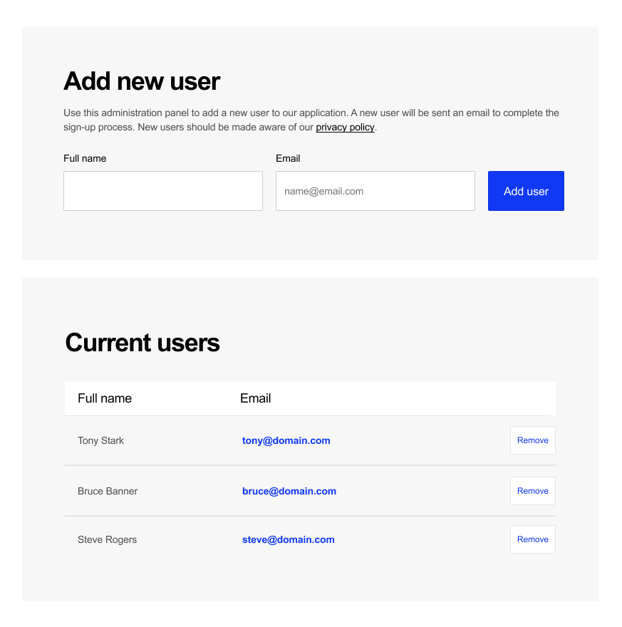

# Front-end Test - User input interface
This is a challenge for front-end candidates

Create an interface for inserting users into a list. The interface requirements consist of:

## Insertion section

This section should include an introduction, a form, an input for the name, an input for the email, and a submit button.

Both fields are required fields and the email should be validated prior to submission. When a new user is added, it should be added to the list of current users in the subsequent section.

## Current users section

The section where current users are displayed. The list should be built using a table element with appropriate semantic elements.

The interface should allow current users to be removed. Email addresses should open a new email to the clicked address. 

## Additional UI information

* The font used is Arial.
* Font sizes can be determined by approximation.
* The blue colour used is #1139f5
* The light grey colour used is #F7F7F7

## Considerations:

* Do not use any CSS from pre-styled frameworks or libraries. We want to see your understanding of CSS and styling practices
* Adding the new user directly to the DOM is acceptable
* A message should appear if the name or email field are not provided. Native HTML form validation is acceptable
* A message should appear if the email entered is invalid. Native HTML form validation is acceptable
* Clicking the remove user button should prompt a confirm box before removing the user. A native JavaScript confirm is acceptable
* The provided design should be followed as closely as possible, in a way that is appropriate for a production environment.
* All interactive elements should have appropriate hover and focus styling.
* HTML should be semantic and accessible.
* Flexbox styling should be used for the layout where applicable.
* The layout should be responsive to different desktop window sizes
 

## Nice to have (not required, but can be added if time permits):

* The users data should be stored in and retrieved from local or session storage and when updated, should trigger a UI update
* Custom HTML validation messages are shown for incorrect field inputs
* A custom, fixed position confirm box/modal/dialogue is shown when removing a user.
